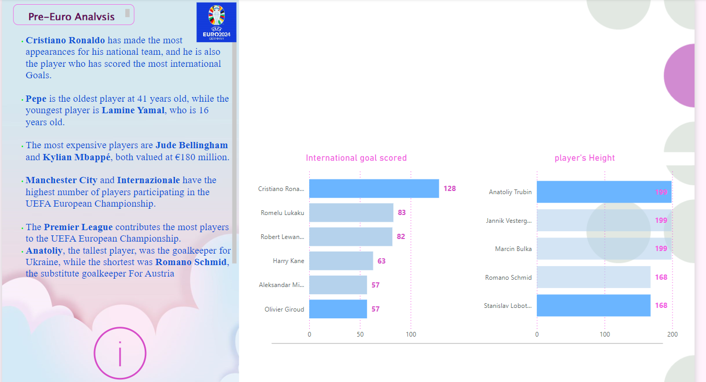
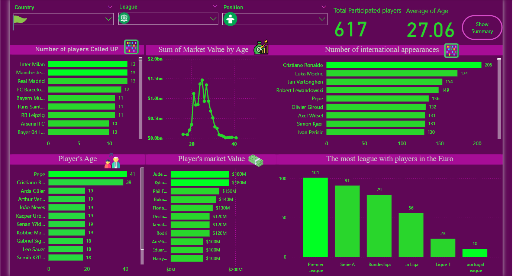

# UEFA-EURO-2024
## Project Description

This project analyzes the UEFA European Championship 2024. It consists of two stages: the first stage is pre-Euro, and the second stage occurs after the championship has finished. In the first stage, we aim to identify information about the participating players and the countries involved. In the second stage, we will delve into the statistical analysis and uncover hidden insights. This involves examining player performance metrics, team dynamics, and any patterns or trends that emerge from the championship data. By doing so, we aim to gain a deeper understanding of the tournament’s dynamics beyond the surface-level results
## Visualizations:
This summary page provides a concise overview of the key insights derived from the colorful infographic related to the UEFA European Championship 2024.Additionally, I’ll add two paragraphs: one highlighting international goals, which represents how good Cristiano Ronaldo is, and the other graph representing the height of each player.

   

  

 Let's break it down:

1. Player Achievements and Age:
   - Cristiano Ronaldo, the iconic forward, dominates the scene. With the most appearances for his national team, he's not only a top scorer but also a consistent performer.
   - Pepe, at 41 years old, defies age norms, while Lamine Yamal, at just 16, represents the youth brigade.

2. International Goals Scored:
   - The bell curve graph caught my attention. It correlates player age with market value. And guess who stands out? Cristiano Ronaldo, of course! His impact on the field transcends numbers.

3. Player Heights:
   - Anatoliy towers as the tallest player, guarding Ukraine's goalposts. In contrast, Romano Schmid is the shortest.
   - These height variations add spice to the game, influencing strategies and gameplay.

Whether you're a football enthusiast or a data aficionado, this infographic offers a glimpse into the fascinating world of European football. 🌟⚽
